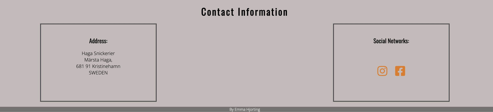

# Carpenter Website Haga Snickerier

This Haga Snickerier website is a page for carpentry.
It's a website for special carpentry our fine woods.

Users of this website will be able to find information about a small company that specialized in wooden crafts.
Here the users can see what the company specialized in. 
And also information about the company.

## Features

* Navigation Bar

  * Featured at the top of the page in the navigation shows carpenter site's name: Haga Snickerier that links to the top of the page.
  * On the right you see other navigation links: Home, About us and Contact. These link to different section of the same page.

* Special Carpentry

  * The section includes a photograph with text overlay. So the users can se exactly which location this site would be applicable to.
  * this animation is to grab the attention to that this site is about Special Carpentry.

* Welcome to Haga Snickerier

  * This is a section on the page to draw attention to the user. Text that will make the users curious.
  * With that dark and light color is a good contrast for the eye.
  
 

* The About Us section

  * the about us section gives details about what the company stands for, what they specialized in and information about the person how owns the company.
  * This section shows the user information about the company and pictures that maybe draw there attention.

* Contact Information
  * The contact section includes two blocks with information to the company Haga Snickerier.
  * In one block the users will find adress to the company.
  * In the other block the users will find two social media icons to Facebook and Instagram.

## Testing

* I tested that this page works in different browsers: Chrome, Firefox, Safari.

* I confirmed that this project is responsive, looks good and functions on all standard screen sizes using the devtools device toolbar.

* I confirmed that the navigation, header, home, about us and contact text are all readable and easy to understand.

* I have confirmed that the form works.

## Bugs

### Solved bugs

* I hade problems with the img in style.css. I could not get it upp in the priview windom.

* I discovered that my img file path was not in the correct order.
./assets/image/css/style.css

* I change the place the place and then I could get it right in my priview window.
./assets/image/jpg

## Validator Test

* HTML
  * No
* CSS
  * No
* Accessibility
  * I confirmed

### 

